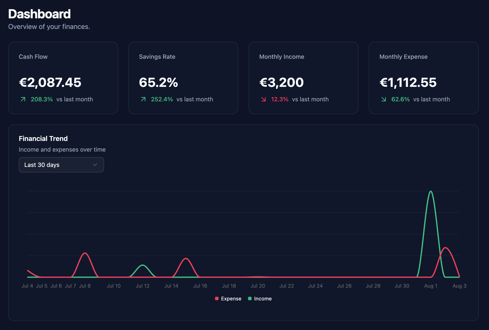
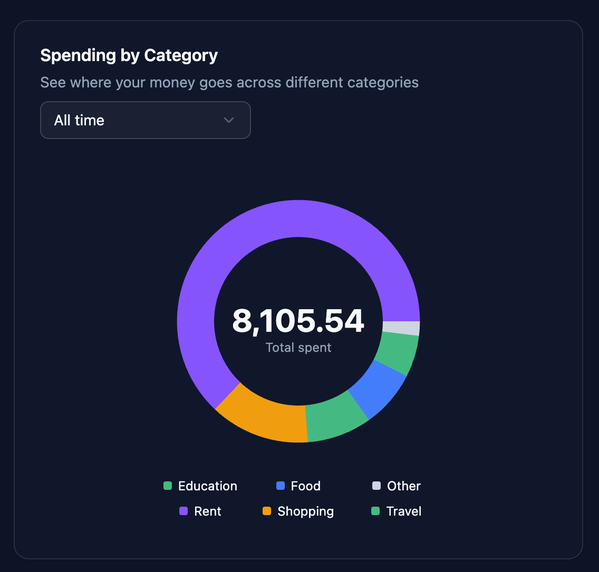

# Transaction Management System

A full-stack transaction management application built to explore modern backend development, frontend architecture, authentication, testing, and production-oriented engineering practices.

The project focuses on maintainable code structure, automated quality checks, database design, authentication flows, and building a complete development workflow from local environment to deployment.

---

# Tech Stack

## Frontend

* React (Vite)
* TypeScript
* TanStack Query
* TanStack Table
* Tailwind CSS

## Backend

* FastAPI
* SQLModel
* PostgreSQL
* Alembic migrations
* Redis

## Development & Quality Tools

* Docker
* GitHub Actions
* Playwright
* Pre-commit hooks
* Ruff
* Pyright
* Pytest
* Vitest
* React Testing Library
* ESLint
* Prettier

---

# Features

## Transaction Management

* Create, read, update, and delete transactions
* Transaction categories
* Transaction type validation
* Filtering and sorting
* Form validation

## Authentication

Implemented authentication flow with:

* JWT-based authentication
* HTTP-only cookies
* Refresh token rotation
* Redis-based session management
* Protected routes
* Secure cookie configuration for production deployment

Planned improvements:

* Email verification
* Password reset flow
* Role-based permissions
* Multi-factor authentication

---

# Dashboard & Financial Analytics

The application includes a dashboard built around aggregated database queries.

Implemented analytics:

* Income and expense overview by time period
* Spending breakdown by category
* Monthly financial summaries
* Cash flow calculation
* Savings rate tracking
* Month-over-month comparisons
* Timezone-aware date aggregation

The dashboard uses PostgreSQL aggregation queries to prepare data for visualization.

---

## Screenshots

#### Main flow


---

#### Dashboard


---

#### Spendings by category pie chart


---


# Testing & Code Quality

The project uses automated testing and static analysis to maintain code quality.

## Backend

* Pytest
* Ruff linting and formatting
* Pyright static type checking

## Frontend

* Playwright end-to-end tests
* ESLint
* Prettier
* TypeScript validation
* Vitest
* React Testing Library

## Automated Checks

Pre-commit hooks and GitHub Actions are used to automatically validate changes.

Configured checks include:

* Code formatting
* Static analysis
* Type checking
* Automated tests
* Configuration validation

---

# Running Locally

## Requirements

* Docker
* Python 3.12+
* Node.js

---

## Backend

## How to Run

1. Create and activate virtual environment
```bash
cd backend

python -m venv .venv

source .venv/bin/activate
```

2. Install dependencies
```
pip install -r requirements.txt
```

3. Copy .env template and add environment variables
```bash
cp .env.example .env
```

4. Start PostgreSQL and Redis containers
```bash
docker compose -f docker-compose.dev.yml up -d
```

5. Run migrations
```bash
alembic upgrade head
```

6. Install pre-commit hooks
```bash
pre-commit install
```

7. Start development server
```bash
fastapi dev app/main.py
```


Backend runs by default at:

```
http://localhost:8000
```

---

## Frontend

1. Install dependencies

```bash
cd frontend

npm install
```

2. Copy .env template and add environment variables
```bash
cp .env.example .env
```

2. Start development server
```bash
npm run dev
```

Frontend runs by default at:

```
http://localhost:5173
```

---

# Deployment

The application is deployed using:

* Frontend: Vercel
* Backend: Fly.io
* Database: Supabase PostgreSQL
* Redis: Upstash/Fly.io Redis

---

# Engineering Practices

The project follows production-oriented development practices:

* Database migrations with Alembic
* Dependency injection with FastAPI
* Automated testing workflows
* Static analysis and formatting
* CI/CD automation
* Containerized development environment

---

# Future Improvements

Planned features:

* More advanced financial analytics
* Additional dashboard visualizations
* Email verification
* Role-based permissions
* Password recovery
* Multi-factor authentication
* Expanded test coverage
